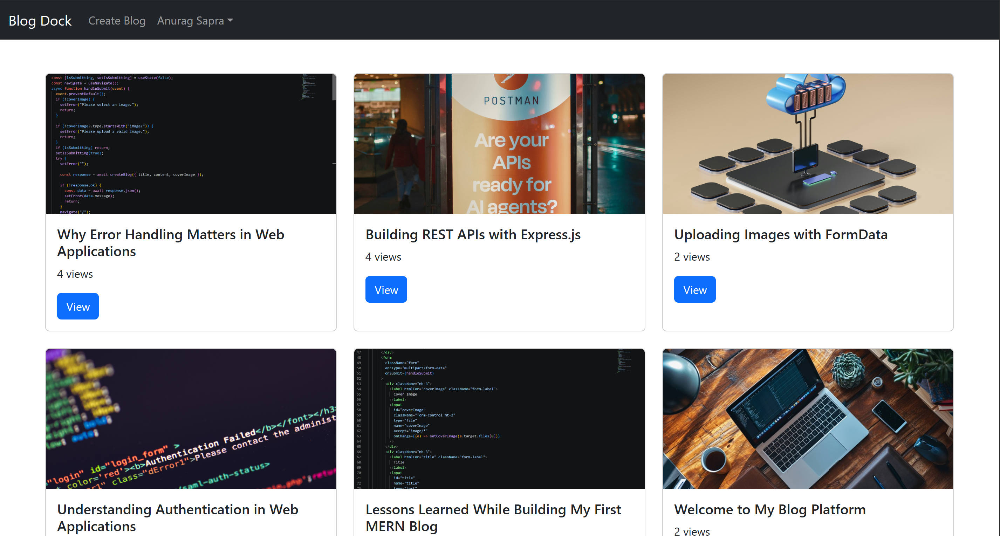
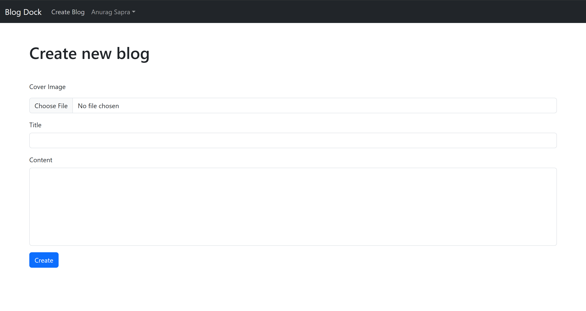
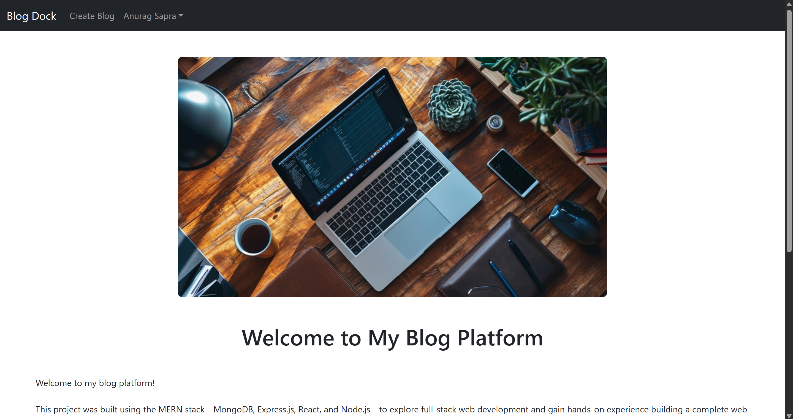
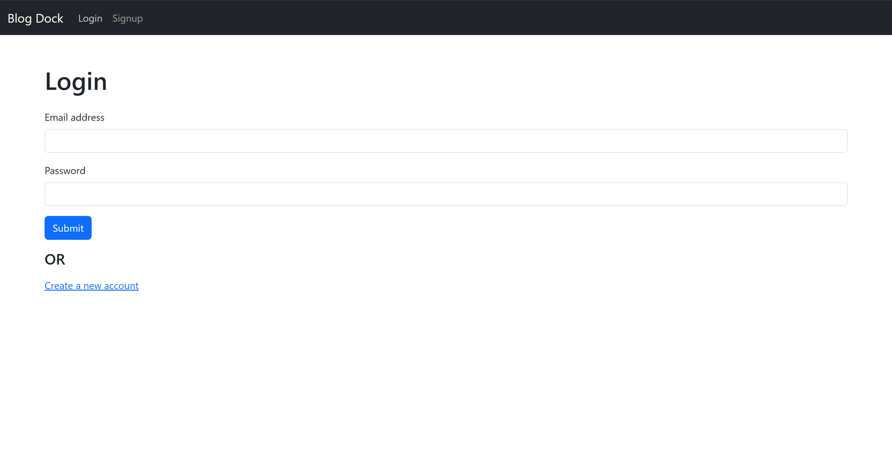

# BlogDock

A full-stack blogging platform built with the MERN stack.

## Features

- User Authentication
- JWT Cookie Authentication
- Role-Based Authorization (Admin/User)
- Create Blogs
- View Blogs
- Delete Blogs (Admin Only)
- Image Uploads with Cloudinary
- Comment System
- Responsive Design
- Loading & Error States

## Tech Stack

### Frontend

- React
- React Router
- Bootstrap
- Vite

### Backend

- Node.js
- Express.js
- MongoDB
- Mongoose
- Multer
- Cloudinary
- JWT

## Screenshots

### Home

### Create Blog

### View Blog

### Login

## Installation

### Backend

npm install

npm start

### Frontend

npm install

npm run dev

## Environment Variables

Backend

MONGO_URL=
JWT_SECRET=
CLOUDINARY_CLOUD_NAME=
CLOUDINARY_API_KEY=
CLOUDINARY_API_SECRET=
FRONTEND_URL=

Frontend

VITE_API_URL=

## Future Improvements

- Blog Editing
- Likes
- Pagination
